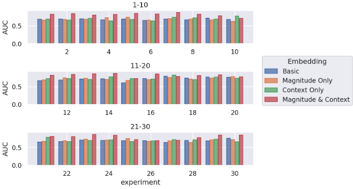
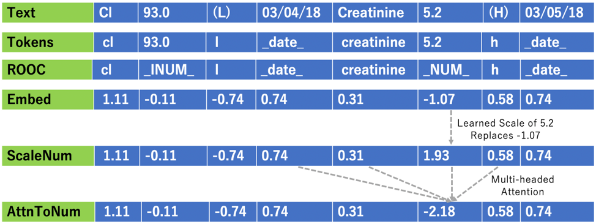

# AttnToNum

## Overview
This research presents AttnToNum, an attention-based embedding technique for numerical values in text. The embeddings are derived from both number magnitude and context words. AttnToNum supassed performance compared to basic embedding for prediction of the composite outcome of Morbitidity or Mortality (MM) after a CABG (coronary artery bypass grafting) surgery. The input was the most recent pre-surgery clinical note.  

Across 10 experiment runs for the prediction of Morbidity and Mortality, the TextCnn architecture with AttnToNum embeddings acheived a mean AUC of 0.821 \[IQR: 0.801-0.840\], compared to a mean AUC of 0.788 \[IQR: 0.766-0.800\] for TextCnn with basic embeddings.

### How To Use
See [example](./directions.ipynb) with simulated data for how to incorporate AttnToNum embeddings with PyTorch. Due to the sensitive PHI nature of the data, we do not release the CABG notes dataset.    

### Number Magnitude or Context?
Embedding of numerical text acheives performance higher than basic embedding if 1) the number magnitudes are incorporated through a scaling network, and 2) context is incorporated via the attention mechanism.
This implies that both scaling (magnitude) and attention (context) are important for capturing numerical information.  

See figure below for a comprasion of performance across embedding types on [simulated data](./directions.ipynb).
  

## ScaleNum
AttnToNum first scales the number through another embedding technique we present, ScaleNum, via a learned log->linear->sigmoid function. 
$$\vec{y}=σ(\vec{a}log(x)+\vec{b})=\frac{x^{\vec{a}}e^{\vec{b}}}{1+x^{\vec{a}}e^{\vec{b}}}$$

AttnToNum then updates the scaled number embeddings based on local attention.

The steps are as follows for CABG analysis:  
Remove out of context numbers (ROOC) -> Embed -> Scale Numbers -> Attention to the Number's Context  
    
ROOC is optional. See [example](./directions.ipynb) on simulated data for residual connections and no ROOC.  
   
The steps are shown in the image below, the embedded values correspond to the first dimension of the dimension-50 embeddings. Residual connections across embeddings can stabilize performance and are available as an option.   

  

## Considerations

Whether or not this embedding will boost classification performance on your dataset depends on key factors:

* Are the numbers predictive?
  * In our case, pre-operative BUN & creatinine values were predictive
* How many unique numbers are in the data?
  * The more unique numbers, the higher the likely performance boost with AttnToNum compared to standard tokenization and embedding. Though other options are available such as rounding the numbers to reduce the token space. With standard tokenization and embedding, the model does not incorporate numerical magnitude unless the same number was found in the train set.
* Negative numbers
  * ScaleNum first takes the log, which only accepts strictly positive numbers in it's domain. Therefore the vocab that tokenizes the text will need to convert negative numbers to positive. For example, clip the values to a very small positive number, or add an offset to negative numbers to make them positive. See line 151 of [vocabs.py](./vocabs.py).
  
